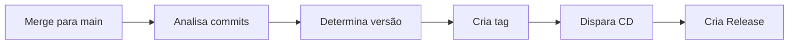

# 🏷️ Auto Versioning e Tags Automáticas

Este repositório possui um sistema de versionamento automático que cria tags sempre que há merge para a branch `main`.

## 🎯 Como Funciona

### Fluxo Automático



1. **Merge para main**: Quando você faz merge de um PR para `main`
2. **Análise automática**: O workflow analisa os commits desde a última tag
3. **Versionamento semântico**: Determina se é `major`, `minor` ou `patch`
4. **Criação de tag**: Cria automaticamente a tag com a nova versão
5. **Release automática**: A tag dispara o workflow de CD que cria a release

## 📊 Semantic Versioning

O sistema segue [Semantic Versioning](https://semver.org/):

```
v[MAJOR].[MINOR].[PATCH]
```

### Como o Tipo de Versão é Determinado

O workflow analisa os **commits convencionais** para decidir qual parte da versão incrementar:

#### 🔴 MAJOR (v2.0.0)
Incrementa quando há **breaking changes**:

```bash
# Qualquer commit com ! ou BREAKING CHANGE
feat!: muda API completamente
fix(api)!: remove endpoint antigo

# Ou no corpo do commit
feat: nova funcionalidade

BREAKING CHANGE: remove suporte a versão antiga
```

**Exemplo**: `v1.5.3` → `v2.0.0`

#### 🟡 MINOR (v1.6.0)
Incrementa quando há **novas funcionalidades**:

```bash
feat: adiciona autenticação OAuth
feat(api): adiciona endpoint de usuários
feature: implementa dashboard
```

**Exemplo**: `v1.5.3` → `v1.6.0`

#### 🟢 PATCH (v1.5.4)
Incrementa quando há **correções**:

```bash
fix: corrige erro no login
fix(auth): valida token corretamente
bugfix: resolve problema de memória
```

**Exemplo**: `v1.5.3` → `v1.5.4`

### 📝 Outros Tipos de Commit

Commits que **não afetam a versão** (mas são incluídos no changelog):

```bash
docs: atualiza README
style: formata código
refactor: reorganiza estrutura
perf: otimiza performance
test: adiciona testes
build: atualiza dependências
ci: ajusta workflows
chore: tarefas gerais
```

**Ação**: Incrementa PATCH (versão mínima) se não houver `feat` ou `fix`

## 🚀 Uso

### Automático (Recomendado)

Simplesmente faça merge do seu PR para `main`:

```bash
# 1. Criar branch
git checkout -b feature/minha-feature

# 2. Fazer commits convencionais
git commit -m "feat: adiciona nova funcionalidade"
git commit -m "fix: corrige bug crítico"

# 3. Push e criar PR
git push origin feature/minha-feature

# 4. Fazer merge do PR para main
# A tag será criada automaticamente!
```

### Manual

Você também pode disparar manualmente e escolher o tipo de versão:

1. Vá em **Actions** → **Auto Tag & Version**
2. Clique em **Run workflow**
3. Selecione o tipo:
   - `auto`: Detecta automaticamente (padrão)
   - `major`: Força versão major (v2.0.0)
   - `minor`: Força versão minor (v1.6.0)
   - `patch`: Força versão patch (v1.5.4)
4. Clique em **Run workflow**

## 📋 Exemplos Práticos

### Exemplo 1: Nova Funcionalidade

```bash
# Commits desde última tag (v1.2.3)
feat: adiciona filtro de busca
feat: implementa paginação
docs: atualiza documentação

# Resultado
✅ Nova tag criada: v1.3.0 (minor)
```

### Exemplo 2: Apenas Correções

```bash
# Commits desde última tag (v1.2.3)
fix: corrige erro de validação
fix: resolve bug no formulário

# Resultado
✅ Nova tag criada: v1.2.4 (patch)
```

### Exemplo 3: Breaking Change

```bash
# Commits desde última tag (v1.2.3)
feat!: muda estrutura da API
fix: corrige endpoints antigos

BREAKING CHANGE: remove suporte a v1 da API

# Resultado
✅ Nova tag criada: v2.0.0 (major)
```

### Exemplo 4: Primeira Release

```bash
# Nenhuma tag anterior
feat: implementa login
feat: adiciona dashboard
fix: corrige bug inicial

# Resultado
✅ Nova tag criada: v0.1.0 (começando do v0.0.0)
```

## 🎨 Personalizando o Comportamento

### Desabilitar Auto-Tagging

Se você quiser criar tags manualmente, pode:

1. **Remover o workflow**:
   ```bash
   rm .github/workflows/auto-tag.yml
   ```

2. **Ou desabilitar o trigger automático** (edite `auto-tag.yml`):
   ```yaml
   on:
     # push:
     #   branches:
     #     - main
     workflow_dispatch:  # Mantém execução manual
   ```

### Mudar Branch de Auto-Tag

Para criar tags em outra branch (ex: `production`):

```yaml
on:
  push:
    branches:
      - production  # Mude aqui
```

### Adicionar Prefixo Customizado

Para usar prefixo diferente (ex: `release/1.0.0` ao invés de `v1.0.0`):

Edite a linha no workflow:
```bash
NEW_VERSION="release/${MAJOR}.${MINOR}.${PATCH}"
```

## 🔧 Troubleshooting

### Tag não foi criada

**Possíveis causas**:

1. **Nenhum commit novo desde a última tag**
   - Solução: Faça commits e tente novamente

2. **Tag já existe**
   - Solução: Não é necessário ação, a tag já foi criada

3. **Permissões insuficientes**
   - Verifique: `Settings` → `Actions` → `General`
   - Configure: `Workflow permissions` → `Read and write permissions`

### Versão errada foi criada

Se a versão gerada não foi a esperada:

1. **Use execução manual** com tipo específico:
   - `Actions` → `Auto Tag & Version` → `Run workflow`
   - Selecione o tipo correto

2. **Delete a tag errada e recrie**:
   ```bash
   # Delete localmente
   git tag -d v1.2.3
   
   # Delete no GitHub
   git push origin :refs/tags/v1.2.3
   
   # Execute o workflow manualmente
   ```

### Commits não convencionais

Se seus commits não seguem o padrão convencional:

- **Sempre incrementa PATCH** por padrão
- **Recomendação**: Adote [Conventional Commits](https://www.conventionalcommits.org/)

## 📚 Convenção de Commits

### Template Completo

```
<tipo>[escopo opcional]: <descrição>

[corpo opcional]

[rodapé opcional]
```

### Tipos Principais

- `feat`: Nova funcionalidade → **MINOR**
- `fix`: Correção de bug → **PATCH**
- `feat!` ou `fix!`: Breaking change → **MAJOR**

### Tipos Secundários

- `docs`: Documentação
- `style`: Formatação
- `refactor`: Refatoração
- `perf`: Performance
- `test`: Testes
- `build`: Build/Dependencies
- `ci`: CI/CD
- `chore`: Outros

### Exemplos de Bons Commits

```bash
# Com escopo
feat(auth): adiciona login com Google
fix(api): corrige validação de email
docs(readme): atualiza instruções de instalação

# Breaking change
feat(api)!: muda estrutura de resposta

BREAKING CHANGE: o campo 'user' foi renomeado para 'account'

# Múltiplas linhas
feat: implementa carrinho de compras

Adiciona funcionalidade completa de carrinho incluindo:
- Adicionar produtos
- Remover produtos
- Calcular totais
- Aplicar cupons de desconto

Closes #123
```

## 🔗 Integração com CD

O workflow de auto-tagging trabalha em conjunto com o CD:

```
Auto Tag (auto-tag.yml)
    ↓ cria tag
    ↓
CD Deploy (cd.yml)
    ↓ detecta tag
    ↓
Cria Release Automaticamente
    ↓
Notifica e Comenta em PRs
```

Tudo acontece automaticamente! 🎉

## ✅ Checklist

Antes de fazer merge para `main`:

- [ ] Commits seguem o padrão convencional
- [ ] Tipo correto de commit (`feat`, `fix`, etc.)
- [ ] Breaking changes marcados com `!` ou `BREAKING CHANGE:`
- [ ] Código testado e aprovado
- [ ] PR revisado e aprovado
- [ ] CI passou com sucesso

## 📞 Recursos

- [Semantic Versioning](https://semver.org/)
- [Conventional Commits](https://www.conventionalcommits.org/)
- [Keep a Changelog](https://keepachangelog.com/)

---

**🎯 Dica**: Use commits convencionais e deixe o sistema cuidar do versionamento automaticamente!

